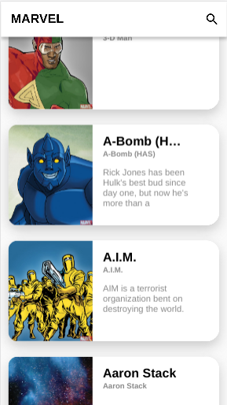
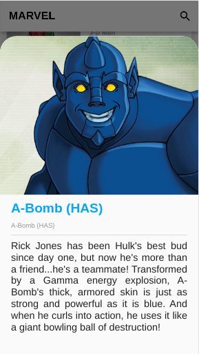

# MARVEL characters

- A simple application that lists the characters using an official MARVEL api.

Design credit - [by Ruslan Riznyk](https://dribbble.com/shots/4985712-Marvel-Heroes-Library/attachments/1114938)

### Screenshots

 

### Created & Maintained By

[Marcos Stark](https://github.com/marcostark) ([@mrcsStark](https://twitter.com/mrcsStark)) 
([Insta](https://www.instagram.com/mrstark.dev/))

### TODO

- [x] List of characters
- [x] Character details
- [ ] Infinite list
- [ ] Search for character by name

## Getting Started

For help getting started with Flutter, view our online
[documentation](https://flutter.io/).
